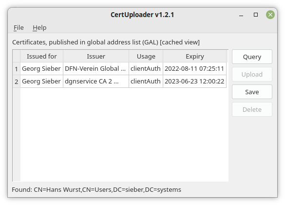

# CertUploader
The CertUploader enables you to upload/publish your personal (email) certificate into your companies LDAP directory (e.g. Active Directory). Other employees need the public key from your certificate in order to send encrypted emails to you (using Outlook, Evolution or other SMIME compatible mail clients).



## Why?
This feature is basically provided by Outlook (Button "Publish in GAL" in the Trust Center). Unfortunately, this button is not visible anymore as soon as you add multiple email certificates into outlook. Great job, Microsoft! That's why and to provide this functionality for Linux clients, I developed this tiny python GUI.

Bonus: in contrast to the Active Directory user edit dialog (which enables administrators to view the user certiciates), the window of this application can be resized. Yay!

### Kerberos Authentication
The application supports Kerberos authentication which means that you can use the client without entering a password if you are logged in with a domain account and have a valid Kerberos ticket (for this, an SSL connection is required). If not, ldap3's "simple" authentication is used as fallback and the client will ask you for username and password.

### SSL Connection
It is highly recommended to turn on SSL in the config file (`~/.config/laps-client/settings.json`) if your LDAP server has a valid certificate (set `ssl` to `true` and `port` to `636`). You can also configure multiple LDAP server in the config file.

### Default Config File
You can create a preset config file `/etc/certuploader.json` which will be loaded if `~/.config/certuploader/settings.json` does not exist. With this, you can distribute default settings (SSL on etc.) for new users.

### Certificate Cache
Once you queried your certificates they will be cached in `~/.config/certuploader/certificates.json` and shown on next program start without LDAP query.

### Certificate Expiration Check
You can start CertUploader with the parameter `--check-expiry`. This will check the cached certificates and display a desktop notification if one of them expires soon (time range can be defined in the settings file). It is intended to place this script call in your autostart.

### Tested Platforms
The application is executable under Linux, Windows and macOS.

## Development
### I18n
```
# 1. Create translation files from code
pylupdate5 certuploader.py -ts lang/de.ts

# 2. Use Qt Linguist to translate the file

# 3. Compile translation files for usage
lrelease lang/de.ts
```

### Compiling (on Windows and macOS)
```
pyinstaller certuploader.windows.spec
```

## Support
You can hire me for commercial support or adjustments for this project. Please [contact me](https://georg-sieber.de/?page=impressum) if you are interested.
